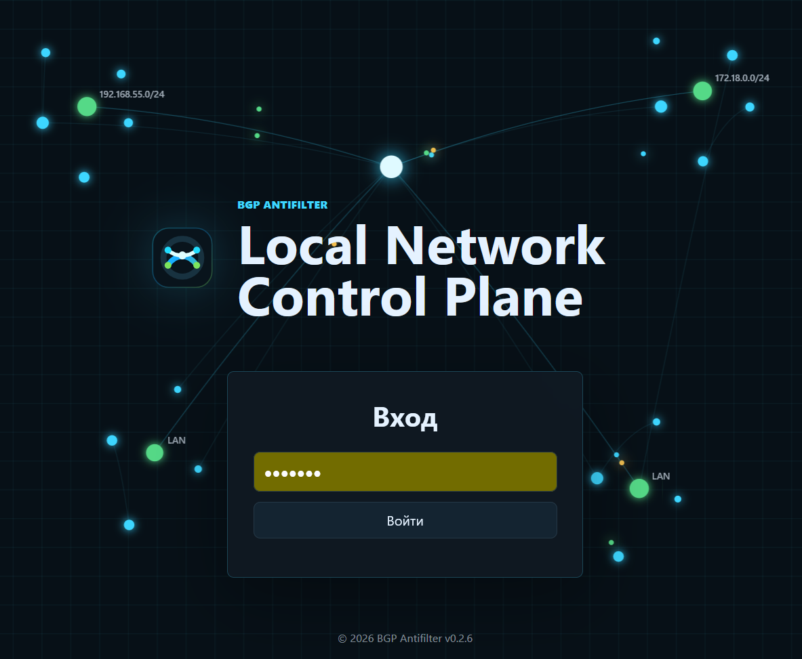
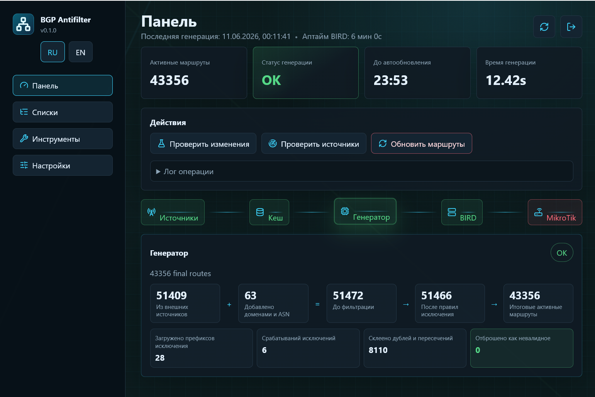
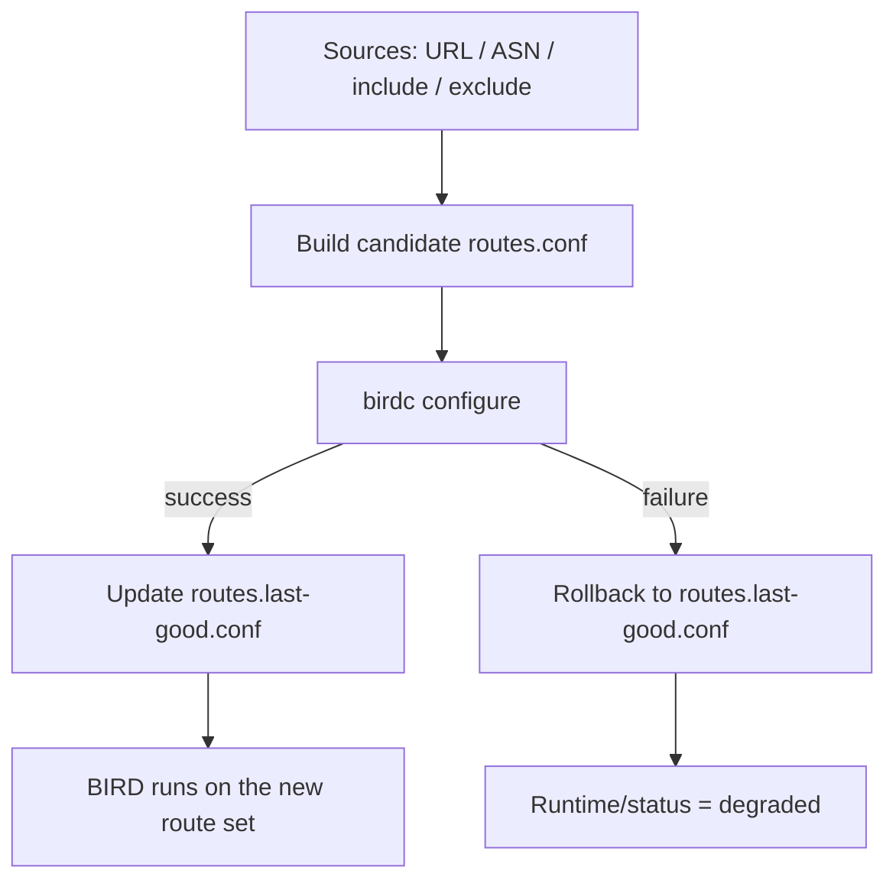

# BGP Antifilter


English | [Русский](README.md)

BGP Antifilter is a containerized BIRD 2 configuration for announcing blocked IPv4 routes and prefixes to MikroTik via BGP.

The project helps bypass modern VPN detection systems by splitting traffic between blocked and unblocked resources. It is intended for home routers with BGP support, such as MikroTik, and for multi-layer VPN servers with an ingress point inside the local country, where local traffic must stay inside the country.

The project downloads route lists from public sources, enriches them with IPv4 addresses resolved from manually configured domains, removes routes for excluded domains, and generates BIRD `blackhole` static routes.



## Navigation

- [Quick Start](#quick-start)
- [Project Contents](#project-contents)
- [How It Works](#how-it-works)
- [Configuration](#configuration)
- [Web Admin](#web-admin)
- [Running](#running)
- [Managing Lists](#managing-lists)
- [Startup And Rollback Model](#startup-and-rollback-model)
- [Verification And Rollback](#verification-and-rollback)
- [Troubleshooting](#troubleshooting)
- [Operations Checklist](#operations-checklist)
- [MikroTik Example](#mikrotik-example)

## Quick Start

If you want the shortest path to a working setup:

1. Copy the example environment: `cp .env.example .env`.
2. Review `MY_AS`, `MT_AS`, `MT_IP`, `BIRD_IP`, `ROUTER_ID`, and `BGP_COMMUNITY`.
3. Add at least one URL source to `generated/config/lists.txt`, or let the first start populate defaults.
4. If needed, enable the admin UI: `ADMIN_ENABLED=1`, `ADMIN_PORT=8080`, `ADMIN_PASSWORD=change-me`.
5. Start the stack: `docker compose up -d --build`.
6. Check state with `docker compose ps` and `docker compose logs -f bird admin`.
7. Before changing lists, run `docker compose exec bird /update-routes.py --dry-run`, then apply with `docker compose exec bird /reload-routes.sh`.

If the container already has a confirmed snapshot from a previous successful run, BIRD starts with it immediately and the refresh happens in the background.

## Project Contents

- `deploy/` - canonical runtime files: `Dockerfile`, `docker-compose.yml`, shell scripts, and `bird.conf.template`.
- `scripts/` - Python entrypoint wrappers used by the container and manual checks.
- `bgp_antifilter/` - main route generation, admin UI backend, and utility logic.
- `admin-ui/` - static web admin assets.
- `default-lists/` - default source lists, ASN list, and include/exclude domain lists copied on first start.
- `.env.example` - example AS, IP, update interval, cache, and healthcheck settings.
- `generated/config/lists.txt` - the user's working IP/CIDR source list.
- `generated/config/include-asns.txt` - the user's working ASN list.
- `generated/config/include-domains.txt` - the user's working include-domain list.
- `generated/config/exclude-domains.txt` - the user's working exclude-domain list.
- `generated/` - generated route cache, not stored in git.

## How It Works

1. The container renders `/etc/bird/bird.conf` from `deploy/bird.conf.template`.
2. BIRD starts with the rendered configuration.
3. `deploy/entrypoint.sh` calls `update-routes.py`.
4. On first start, `deploy/entrypoint.sh` copies defaults from `default-lists/` into `generated/config/`, then fetches URLs from the working `generated/config/lists.txt`.
5. ASNs from `generated/config/include-asns.txt` are loaded from the RouteViews API.
6. If `INCLUDE_GOOGLE_RANGES=1`, Google `goog.json` and `cloud.json` are fetched; Cloud prefixes are subtracted from the general Google list.
7. `scripts/generate-routes.py` extracts and validates IPv4/CIDR routes from text or JSON sources.
8. Domains from `generated/config/include-domains.txt` are resolved to IPv4 and added as `/32`.
9. Domains from `generated/config/exclude-domains.txt` are resolved to IPv4 and subtracted from the final route set.
10. `generated/routes.conf` is included by BIRD as static `blackhole` routes.
11. BIRD exports the routes to MikroTik via BGP.

## Configuration

Copy the example environment file and adjust it for your network:

```bash
cp .env.example .env
```

If you are upgrading from the previous repository layout, move your custom list files into `generated/config/`: `lists.txt`, `include-asns.txt`, `include-domains.txt`, and `exclude-domains.txt`.

Main settings:

```dotenv
BGP_ANTIFILTER_VERSION=0.3.3
MY_AS=64500
MT_AS=65455
MT_IP=192.168.55.1
BIRD_IP=192.168.55.5
ROUTER_ID=192.168.55.5
BGP_COMMUNITY=65432,500
UPDATE_INTERVAL=1800
CACHE_MAX_AGE=604800
INCLUDE_GOOGLE_RANGES=1
REQUIRE_ALL_URL_SOURCES=0
MIN_PREFIX_LENGTH=8
ALLOW_BROAD_ROUTES=0
UPDATE_LOCK_DIR=/etc/bird/generated/update.lock
HEALTHCHECK_REQUIRE_BGP=1
HEALTHCHECK_FAIL_ON_DEGRADED=0
BGP_PROTOCOL=mikrotik
ADMIN_ENABLED=0
ADMIN_PORT=8080
ADMIN_PASSWORD=
```

- `BGP_ANTIFILTER_VERSION` - local Docker image tag; defaults to `0.3.3`.
- `MY_AS` - AS number used by the BIRD container.
- `MT_AS` - MikroTik AS number.
- `MT_IP` - MikroTik IP address.
- `BIRD_IP` - host/interface IP used by BIRD for the BGP session.
- `ROUTER_ID` - BIRD router ID, usually the same as `BIRD_IP`.
- `BGP_COMMUNITY` - community added to exported routes.
- `UPDATE_INTERVAL` - route refresh interval in seconds.
- `CACHE_MAX_AGE` - maximum source cache age in seconds; defaults to 7 days.
- `INCLUDE_GOOGLE_RANGES` - `1` adds default Google service ranges from `goog.json` excluding Google Cloud from `cloud.json`; `0` disables this source.
- `REQUIRE_ALL_URL_SOURCES` - `1` makes every URL from `generated/config/lists.txt` mandatory; `0` by default allows an unavailable URL source to be skipped if the final route set can still be built from other data.
- `MIN_PREFIX_LENGTH` - shortest IPv4 prefix accepted from external sources; defaults to `8`.
- `ALLOW_BROAD_ROUTES` - `1` disables the broad-route safety guard; defaults to `0`.
- `UPDATE_LOCK_DIR` - lock directory used to prevent parallel route updates.
- `HEALTHCHECK_REQUIRE_BGP` - `1` requires an established BGP session in Docker healthcheck; `0` checks only BIRD and routes.
- `HEALTHCHECK_FAIL_ON_DEGRADED` - `1` makes the Docker healthcheck fail when the container had to keep the previous working route snapshot after an unsuccessful update; `0` by default keeps the container healthy and exposes the degraded state only through `status.json`, `runtime.json`, and the admin UI.
- `BGP_PROTOCOL` - BIRD BGP protocol name used by healthcheck; defaults to `mikrotik`.
- `ADMIN_ENABLED` - `1` enables the web admin UI; defaults to `0`.
- `ADMIN_PORT` - web admin port; defaults to `8080`.
- `ADMIN_PASSWORD` - web admin login password; required when `ADMIN_ENABLED=1`.

If `.env` is missing, defaults from the compose configuration are used.

## Web Admin

The admin UI is disabled by default. Enable it by setting a password and port:

```dotenv
ADMIN_ENABLED=1
ADMIN_PORT=8080
ADMIN_PASSWORD=change-me
```



After restarting the container, the interface is available on the configured host port. The UI includes an RU/EN language switch, a dashboard with the next auto-refresh countdown, BIRD/BGP status, route counts and source summary, `dry-run`, `check-sources`, `reload`, IP or domain lookup, metrics, route and container log views, `routes.conf` download, an editor for all four list files, and a settings page.

Main sections:

- `Dashboard` - current BIRD/BGP state, route count, last generation time, and `dry-run`, `check-sources`, `reload` actions.
- `Lists` - editing `lists.txt`, `include-asns.txt`, `include-domains.txt`, and `exclude-domains.txt` without `git pull` conflicts.
- `Tools` - metrics, active routes, container logs, and IP/domain diagnostics.
- `Settings` - runtime generator settings plus BGP and healthcheck-related parameters.

How to read statuses:

- `OK` - the last operation completed successfully and BIRD accepted the current configuration.
- `Warning` - a generation is running, cache is being used, or the container is in `degraded` mode on the previous confirmed snapshot.
- `Failed` - the last operation ended with an error and the new route set was not applied.

With `ADMIN_ENABLED=1`, the separate `admin` service is always started. This avoids stdout/stderr contention with the BIRD container and keeps behavior consistent across Linux and Docker Desktop for Windows/macOS. The `admin` service publishes the UI port through regular `ports:` and talks to BIRD through the shared `/run/bird` socket and shared `generated/` files.

Working files `generated/config/lists.txt`, `generated/config/include-asns.txt`, `generated/config/include-domains.txt`, and `generated/config/exclude-domains.txt` live outside git and are edited by the admin UI without `git pull` conflicts. If a file does not exist yet, the container creates it from the default version in `default-lists/`. A backup is created in `generated/list-backups` before saving.

At startup, the container validates environment values before starting BIRD:

- `MY_AS` and `MT_AS` must be integer AS numbers.
- `MT_IP`, `BIRD_IP`, and `ROUTER_ID` must be valid IPv4 addresses.
- `BGP_COMMUNITY` must use the `AS,VALUE` tuple format, for example `65432,500`.
- `UPDATE_INTERVAL` must be a positive number of seconds.
- `CACHE_MAX_AGE` must be a positive number of seconds.

## Running

From the repository root, you can use short `docker compose ...` commands: the root-level `docker-compose.yml` is kept as a convenience entrypoint and automatically picks up `.env`.

```bash
docker compose up -d --build
```

Show logs:

```bash
docker compose logs -f bird admin
```

Check container status:

```bash
docker compose ps
```

Stop:

```bash
docker compose down
```

## Managing Lists

Add new IP/CIDR sources to `generated/config/lists.txt`, one URL per line.

Sources may be plain text or JSON. The generator extracts IPv4/CIDR values from source content, so URLs such as `format=json&data=cidr4` are supported. Example:

```text
https://iplist.opencck.org/?format=json&data=cidr4&site=claude.ai&site=chatgpt.com&site=copilot&site=deepseek.com&site=grok.com
```

If you have multiple lists, add each URL as a separate line in `generated/config/lists.txt`.

ASNs whose announced IPv4 prefixes should be force-added go into `generated/config/include-asns.txt`. For example, `AS32934` adds Meta routes for Facebook, Instagram, WhatsApp, and Messenger.

For YouTube, a dedicated Google ranges source is enabled: with `INCLUDE_GOOGLE_RANGES=1`, the container uses `https://www.gstatic.com/ipranges/goog.json`, subtracts `https://www.gstatic.com/ipranges/cloud.json`, and adds the remaining IPv4 prefixes. YouTube domains in `generated/config/include-domains.txt` remain an additional point source.

Domains to force-add go into `generated/config/include-domains.txt`. These domains are best-effort: if a domain temporarily does not resolve and has no cache, it is marked as `skipped`, but route updates continue.

Domains to exclude go into `generated/config/exclude-domains.txt`. These domains are strict: if an exclude domain cannot be resolved and has no fresh cache, the new `routes.conf` is not applied. If an excluded IP is inside a larger prefix, the generator splits the prefix into smaller routes without that IP.

Before writing the final file, the generator removes exact duplicates, drops routes already covered by larger prefixes, and collapses adjacent networks when doing so does not reintroduce excluded addresses.

If a URL source from `generated/config/lists.txt` is temporarily unavailable, the default behavior is to mark it as `failed` but continue building from other sources and apply the result if the final route set is still non-empty. Enable `REQUIRE_ALL_URL_SOURCES=1` for strict mode; then any URL without fresh cache stops the update.

Blank lines and lines starting with `#` are ignored.

## Startup And Rollback Model

The project uses two route files:

- `generated/routes.conf` - the current active file included by BIRD.
- `generated/routes.last-good.conf` - the confirmed snapshot, updated only after a successful `birdc configure`.



Startup behavior:

1. If `routes.last-good.conf` exists and is non-empty, the container copies it into `routes.conf` and starts BIRD immediately.
2. After BIRD is up, the container performs a background source refresh and `birdc configure`.
3. If no confirmed snapshot exists yet, the container still builds routes before starting BIRD.

Update behavior:

1. The generator builds a new candidate in a temporary file.
2. The candidate replaces `routes.conf` only for the `birdc configure` step.
3. If BIRD accepts the configuration, the candidate becomes the new `routes.last-good.conf`.
4. If generation or apply fails, the container rolls back to `routes.last-good.conf` and marks the state as `degraded`.

## Verification And Rollback

Before applying a new `generated/routes.conf`, the container relies on a separate confirmed snapshot at `generated/routes.last-good.conf`. That file is updated only after a successful `birdc configure` and serves as the last-known-good state for restart and rollback. Every network source has a separate cache in `generated/cache`: URLs from `generated/config/lists.txt`, ASN prefixes, Google ranges, and DNS results for include/exclude domains. If a source is temporarily unavailable, the generator uses its last cache and continues updating other sources.

Cache is used only while it is younger than `CACHE_MAX_AGE`; the default is 604800 seconds, or 7 days. If an unavailable source has no fresh cache, the final route file is not updated and `routes.last-good.conf` stays active. If `birdc configure` rejects the new configuration, `deploy/reload-routes.sh` restores the confirmed snapshot and asks BIRD to apply the working version again.

On startup, the container first checks whether a non-empty `generated/routes.last-good.conf` from the previous successful run already exists. If it does, BIRD starts immediately with that confirmed snapshot, and route refresh plus `birdc configure` happen in the background after startup. If no confirmed snapshot exists yet, the container still prepares routes before starting BIRD so it does not come up with an empty table.

After each update attempt, diagnostic files are written:

- `generated/status.json` - update result, route counts, per-source status (`fresh`, `cache`, `skipped`, `failed`, `disabled`), and errors.
- `generated/metrics.prom` - Prometheus text format metrics: route count, update success, last attempt time, and source status summary.

Update logs are emitted as structured JSON with `ts`, `level`, `message`, and context fields for the current stage or source. Route refreshes are protected by the `generated/update.lock` directory, so manual and scheduled updates do not write `routes.conf`, `status.json`, or `metrics.prom` concurrently.

By default, the generator refuses IPv4 routes broader than `/8`, such as `0.0.0.0/0`. Change the threshold with `MIN_PREFIX_LENGTH`; disable the guard only explicitly with `ALLOW_BROAD_ROUTES=1`.

Docker healthcheck checks `birdc show status`, non-empty `generated/routes.conf`, non-zero route count in `status.json`, and, if `HEALTHCHECK_REQUIRE_BGP=1`, the BGP protocol state from `BGP_PROTOCOL`. If you enable `HEALTHCHECK_FAIL_ON_DEGRADED=1`, the healthcheck also fails when a new update could not be applied and the container keeps serving the previous working snapshot.

Check BIRD status inside the container:

```bash
docker compose exec bird birdc show status
```

Show the number of exported static routes:

```bash
docker compose exec bird birdc show route protocol static_antifilter count
```

Check whether an IP is present in the generated route database and show cached source matches:

```bash
docker compose exec bird /check-ip.py 1.2.3.4
```

The command checks whether the IP is covered by `generated/routes.conf`, then searches source caches referenced by `generated/status.json`. It exits with code `0` when the IP is present in the final route file and `1` when it is not.

For scripts, use machine-readable output:

```bash
docker compose exec bird /check-ip.py 1.2.3.4 --json
```

Force a route refresh without restarting BIRD:

```bash
docker compose exec bird /reload-routes.sh
```

This command refreshes sources inside the running container. Existing routes stay active until the new candidate `routes.conf` is generated and accepted by `birdc configure`. If generation or apply fails, the container rolls back to `routes.last-good.conf`.

During a manual refresh and in `docker compose logs -f bird admin`, progress is printed by stage: URL/ASN/Google ranges fetching, include/exclude domain resolving, parsing, final route table build, and status/metrics writing.

Validate an update without writing `routes.conf`, `status.json`, or `metrics.prom`:

```bash
docker compose exec bird /update-routes.py --dry-run
```

Dry-run fetches and validates sources, builds the final table in memory, and prints a JSON summary. Source caches may be refreshed, but active routes and diagnostic files are not changed.

Check only source availability without parsing routes or writing diagnostic files:

```bash
docker compose exec bird /update-routes.py --check-sources
```

If `make` is installed, short commands are available:

```bash
make up
make logs
make reload
make dry-run
make check-sources
make check-ip IP=1.2.3.4
```

## Troubleshooting

If something goes wrong, start with these files:

- `generated/status.json` - result of the last update, source states, and errors.
- `generated/runtime.json` - active progress, startup snapshot data, `degraded`, and the outcome of the last apply.
- `generated/metrics.prom` - summary metrics for monitoring.
- `generated/routes.last-good.conf` - the last confirmed snapshot.

Common scenarios:

| Symptom | Where to look | Command / action |
| --- | --- | --- |
| BIRD did not start after the first boot | `docker compose logs -f bird admin`, `generated/status.json` | Confirm that the generator produced a non-empty `routes.conf` and did not stop on a validation error |
| The container is running but a new update was not applied | `generated/runtime.json` | Check `degraded`, `degraded_reason`, and `last_update_success` |
| `dry-run` or `check-sources` fails | `generated/status.json`, `generated/cache` | Look for sources with `failed` status and verify cache freshness plus URL/DNS availability |
| The route count unexpectedly dropped or became zero | `generated/status.json`, `generated/metrics.prom` | Review `routes.final`, `routes.invalid`, and the values of `REQUIRE_ALL_URL_SOURCES`, `MIN_PREFIX_LENGTH`, and `ALLOW_BROAD_ROUTES` |
| BGP does not establish while BIRD itself is up | `birdc show status`, `birdc show protocols <BGP_PROTOCOL>` | Verify `MT_IP`, `BIRD_IP`, `MY_AS`, `MT_AS`, and `BGP_PROTOCOL` |
| You need to confirm what stays active after a failed reload | `generated/routes.last-good.conf`, `generated/runtime.json` | Confirm that the previous verified snapshot is still active and that rollback actually happened |

## Operations Checklist

- Run dry-run before changing `generated/config/lists.txt`, `generated/config/include-asns.txt`, `generated/config/include-domains.txt`, or `generated/config/exclude-domains.txt`.
- After manual reload, check `generated/status.json`: `success` should be `true`, and `routes.final` should be greater than zero.
- On MikroTik, accept only routes with the expected BGP community and reject everything else.
- Keep exclude-domain caches fresh: if DNS is unavailable and no cache exists, the update intentionally fails.
- Monitor `bgp_antifilter_update_success`, `bgp_antifilter_routes_total`, and source cache age in `metrics.prom`.
- Do not set `ALLOW_BROAD_ROUTES=1` unless you understand which source produced the broad prefix.


## MikroTik Example

Minimal RouterOS 7 example:

```routeros
/routing bgp template
add name=antifilter-template as=65455 routing-table=main

/routing bgp connection
add name=antifilter-bird \
    template=antifilter-template \
    remote.address=192.168.55.5 \
    remote.as=64500 \
    local.address=192.168.55.1 \
    multihop=yes \
    input.filter=antifilter-in

/routing filter rule
add chain=antifilter-in rule="if (bgp-communities includes 65432:500) { accept } else { reject }"
```

AS and IP parameters must match the values in `.env`.
