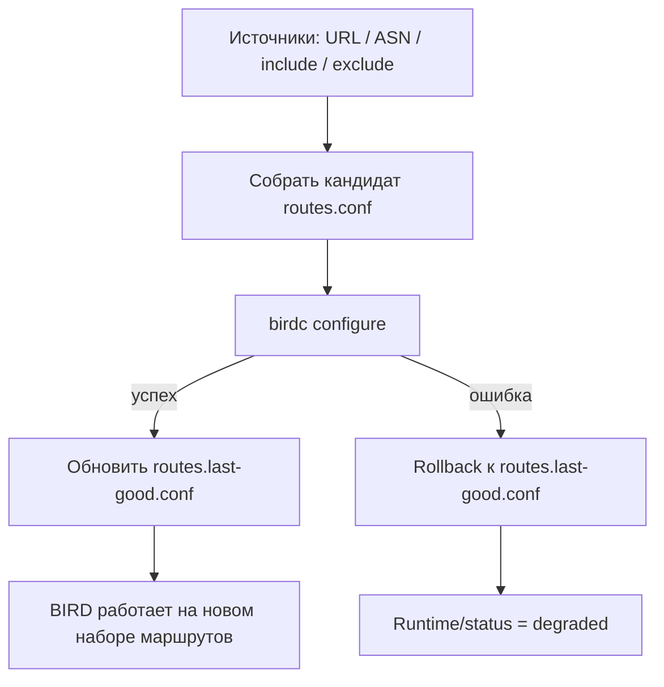

# BGP Antifilter


[English](README.en.md) | Русский

BGP Antifilter - контейнеризированная конфигурация BIRD 2 для публикации списков заблокированных IP-адресов и подсетей в MikroTik по BGP.

Проект помогает обходить современные системы детекции VPN, за счет распределения трафика между заблокированными и незаблокированными ресурсами. Он рассчитан на домашние роутеры с поддержкой BGP (например MikroTik), а также на многоуровневые VPN-серверы с входящей точкой из локальной страны, где важно, чтобы локальный трафик не выходил за пределы страны. 

Проект скачивает списки маршрутов из открытых источников, дополняет их IP-адресами вручную заданных доменов, исключает маршруты для доменов из списка исключений и генерирует `blackhole`-маршруты для BIRD.


## Навигация

- [Быстрый старт](#быстрый-старт)
- [Что входит в проект](#что-входит-в-проект)
- [Как это работает](#как-это-работает)
- [Настройка](#настройка)
- [Веб-админка](#веб-админка)
- [Запуск](#запуск)
- [Управление списками](#управление-списками)
- [Модель старта и отката](#модель-старта-и-отката)
- [Проверка и откат](#проверка-и-откат)
- [Диагностика](#диагностика)
- [Эксплуатационный чеклист](#эксплуатационный-чеклист)
- [Пример настройки MikroTik](#пример-настройки-mikrotik)

## Быстрый старт

Если нужен минимальный путь до рабочего стенда:

1. Скопируйте пример окружения: `cp .env.example .env`.
2. Проверьте `MY_AS`, `MT_AS`, `MT_IP`, `BIRD_IP`, `ROUTER_ID`, `BGP_COMMUNITY`.
3. Добавьте хотя бы один URL-источник в `generated/config/lists.txt` или подготовьте его через дефолты при первом старте.
4. При необходимости включите админку: `ADMIN_ENABLED=1`, `ADMIN_PORT=8080`, `ADMIN_PASSWORD=change-me`.
5. Поднимите контейнер: `docker compose up -d --build`.
6. Проверьте состояние: `docker compose ps` и `docker compose logs -f bird admin`.
7. Перед изменением списков запускайте `docker compose exec bird /update-routes.py --dry-run`, затем применяйте `docker compose exec bird /reload-routes.sh`.

Если после рестарта контейнер уже имел подтвержденный snapshot, BIRD поднимется сразу с ним, а refresh пойдет в фоне.

## Что входит в проект

- `deploy/` - канонические runtime-файлы: `Dockerfile`, `docker-compose.yml`, shell-скрипты и `bird.conf.template`.
- `scripts/` - Python entrypoint-обертки для контейнера и ручных проверок.
- `bgp_antifilter/` - основная логика генерации маршрутов, админки и служебных команд.
- `admin-ui/` - статические файлы веб-админки.
- `default-lists/` - дефолтные списки источников, ASN, стран и include/exclude-доменов, которые копируются при первом старте.
- `.env.example` - пример локальных настроек AS, IP-адресов и интервала обновления.
- `generated/config/lists.txt` - рабочий список исходных IP и подсетей пользователя.
- `generated/config/include-asns.txt` - рабочий список ASN пользователя.
- `generated/config/include-countries.txt` - рабочий список стран пользователя в формате ISO 3166-1 alpha-2 (`US`, `DE`, `NL`).
- `generated/config/include-domains.txt` - рабочий список include-доменов пользователя.
- `generated/config/exclude-domains.txt` - рабочий список exclude-доменов пользователя.
- `generated/` - генерируемый кеш маршрутов, не хранится в репозитории.

## Как это работает

1. Контейнер рендерит `/etc/bird/bird.conf` из `deploy/bird.conf.template`.
2. BIRD запускается с полученной конфигурацией.
3. `deploy/entrypoint.sh` при первом старте копирует дефолты из `default-lists/` в `generated/config/`, затем использует рабочий `generated/config/lists.txt`.
4. ASN из `generated/config/include-asns.txt` загружаются из RouteViews API как анонсированные IPv4-префиксы.
5. Страны из `generated/config/include-countries.txt` загружаются как IPv4-префиксы страны: сначала через RIPE Stat, а если он недоступен, через delegated stats RIR.
6. Если `INCLUDE_GOOGLE_RANGES=1`, загружаются Google `goog.json` и `cloud.json`; Cloud-префиксы вычитаются из общего списка Google.
7. `scripts/generate-routes.py` извлекает и валидирует IPv4/CIDR-маршруты.
8. Домены из `generated/config/include-domains.txt` резолвятся в IPv4 и добавляются как `/32`.
9. Домены из `generated/config/exclude-domains.txt` резолвятся в IPv4 и вычитаются из итогового набора маршрутов.
10. Итоговый файл `generated/routes.conf` подключается в BIRD как статические `blackhole`-маршруты.
11. BIRD экспортирует маршруты в MikroTik через BGP.

## Настройка

Скопируйте пример окружения и измените параметры под свою сеть:

```bash
cp .env.example .env
```

Если вы обновляетесь с предыдущей структуры репозитория, перенесите свои кастомные списки в `generated/config/`: `lists.txt`, `include-asns.txt`, `include-countries.txt`, `include-domains.txt`, `exclude-domains.txt`.

Основные параметры:

```dotenv
BGP_ANTIFILTER_VERSION=0.4.1
MY_AS=64500
MT_AS=65455
MT_IP=192.168.55.1
BIRD_IP=192.168.55.5
ROUTER_ID=192.168.55.5
BGP_COMMUNITY=65432,500
UPDATE_INTERVAL=1800
CACHE_MAX_AGE=604800
INCLUDE_GOOGLE_RANGES=1
REQUIRE_ALL_URL_SOURCES=0
MIN_PREFIX_LENGTH=8
ALLOW_BROAD_ROUTES=0
UPDATE_LOCK_DIR=/etc/bird/generated/update.lock
HEALTHCHECK_REQUIRE_BGP=1
HEALTHCHECK_FAIL_ON_DEGRADED=0
BGP_PROTOCOL=mikrotik
ADMIN_ENABLED=0
ADMIN_PORT=8080
ADMIN_PASSWORD=
```

Где:

- `MY_AS` - AS контейнера с BIRD.
- `BGP_ANTIFILTER_VERSION` - тег локального Docker-образа, по умолчанию `0.4.1`.
- `MT_AS` - AS MikroTik.
- `MT_IP` - IP-адрес MikroTik.
- `BIRD_IP` - IP-адрес хоста или интерфейса, с которого BIRD устанавливает BGP-сессию.
- `ROUTER_ID` - router id BIRD, обычно совпадает с `BIRD_IP`.
- `BGP_COMMUNITY` - community, которая добавляется к экспортируемым маршрутам.
- `UPDATE_INTERVAL` - интервал обновления списков в секундах.
- `CACHE_MAX_AGE` - максимальный возраст кеша источника в секундах, по умолчанию 7 дней.
- `INCLUDE_GOOGLE_RANGES` - `1` добавляет default Google service ranges из `goog.json` за вычетом Google Cloud из `cloud.json`; `0` отключает этот источник.
- `REQUIRE_ALL_URL_SOURCES` - `1` делает каждый URL из `generated/config/lists.txt` обязательным; `0` по умолчанию разрешает пропустить недоступный URL-источник, если итоговая таблица все равно собирается из остальных данных.
- `MIN_PREFIX_LENGTH` - минимальная длина IPv4-префикса, разрешенная из внешних источников, по умолчанию `8`.
- `ALLOW_BROAD_ROUTES` - `1` отключает защиту от слишком широких IPv4-маршрутов; по умолчанию `0`.
- `UPDATE_LOCK_DIR` - lock-директория, предотвращающая параллельные обновления.
- `HEALTHCHECK_REQUIRE_BGP` - `1` требует установленную BGP-сессию в Docker healthcheck; `0` проверяет только BIRD и маршруты.
- `HEALTHCHECK_FAIL_ON_DEGRADED` - `1` делает Docker healthcheck неуспешным, если контейнер остался на предыдущем рабочем snapshot после неудачного обновления; `0` по умолчанию оставляет контейнер healthy, а деградацию показывает только в `status.json`, `runtime.json` и админке.
- `BGP_PROTOCOL` - имя BGP-протокола в BIRD для healthcheck, по умолчанию `mikrotik`.
- `ADMIN_ENABLED` - `1` включает веб-админку, по умолчанию `0`.
- `ADMIN_PORT` - порт веб-админки, по умолчанию `8080`.
- `ADMIN_PASSWORD` - пароль входа в веб-админку; обязателен при `ADMIN_ENABLED=1`.

Если `.env` не создан, используются значения по умолчанию из compose-конфига.

## Веб-админка

Админка выключена по умолчанию. Для включения задайте пароль и порт:

```dotenv
ADMIN_ENABLED=1
ADMIN_PORT=8080
ADMIN_PASSWORD=change-me
```


После перезапуска контейнера интерфейс будет доступен на указанном порту хоста. В админке есть RU/EN-переключатель, dashboard с таймером до следующего автообновления, статусом BIRD/BGP, количеством маршрутов и источниками, запуск `dry-run`, `check-sources`, `reload`, проверка IP или домена, просмотр метрик, маршрутов и логов контейнера, скачивание `routes.conf`, редактор пяти списков и страница настроек.

Основные разделы:

- `Панель` - текущее состояние BIRD/BGP, количество маршрутов, время последней генерации и кнопки `dry-run`, `check-sources`, `reload`.
- `Списки` - редактирование `lists.txt`, `include-asns.txt`, `include-countries.txt`, `include-domains.txt`, `exclude-domains.txt` без конфликтов с `git pull`.
- `Инструменты` - метрики, активные маршруты, логи контейнера и диагностика IP/домена.
- `Настройки` - runtime-параметры генератора и BGP/healthcheck-параметры админки.

Как читать статусы:

- `OK` - последняя операция завершилась успешно, BIRD принял текущую конфигурацию.
- `Warning` - идет генерация, используется кеш или контейнер работает в `degraded`-режиме на предыдущем подтвержденном snapshot.
- `Failed` - последняя операция завершилась ошибкой и новый набор маршрутов не был применен.

При `ADMIN_ENABLED=1` отдельный сервис `admin` поднимается всегда. Это убирает конкуренцию за stdout/stderr у контейнера BIRD и делает поведение одинаковым на Linux и Docker Desktop для Windows/macOS. Сервис `admin` публикует порт через обычный `ports:`, а с BIRD общается через общий `/run/bird` socket и общие файлы `generated/`.

Рабочие файлы `generated/config/lists.txt`, `generated/config/include-asns.txt`, `generated/config/include-countries.txt`, `generated/config/include-domains.txt` и `generated/config/exclude-domains.txt` хранятся вне git и редактируются админкой без конфликтов с `git pull`. Если файла еще нет, контейнер создает его из дефолта из `default-lists/`. Перед сохранением создается backup в `generated/list-backups`.

Во вкладке `Countries` админка показывает заранее подготовленный список стран с тумблерами. В файл `include-countries.txt` сохраняются двухбуквенные коды ISO (`UA`, `US`, `DE`), так что для типового сценария не нужно вручную искать подсети страны.

При старте контейнер проверяет значения окружения до запуска BIRD:

- `MY_AS` и `MT_AS` должны быть целыми AS-номерами.
- `MT_IP`, `BIRD_IP` и `ROUTER_ID` должны быть корректными IPv4-адресами.
- `BGP_COMMUNITY` должен быть указан в формате `AS,VALUE`, например `65432,500`.
- `UPDATE_INTERVAL` должен быть положительным числом секунд.
- `CACHE_MAX_AGE` должен быть положительным числом секунд.

## Запуск

Из корня репозитория можно использовать короткие команды `docker compose ...`: root-level `docker-compose.yml` оставлен как удобная точка входа и автоматически подхватывает `.env`.

```bash
docker compose up -d --build
```

Посмотреть логи:

```bash
docker compose logs -f bird admin
```

Проверить состояние контейнера:

```bash
docker compose ps
```

Остановить контейнер:

```bash
docker compose down
```

## Управление списками

Добавьте новые источники IP-адресов и подсетей в `generated/config/lists.txt`, по одному URL на строку.

Источники могут быть обычным текстом или JSON. Генератор извлекает IPv4/CIDR из содержимого источника, поэтому URL вида `format=json&data=cidr4` тоже поддерживаются. Например:

```text
https://iplist.opencck.org/?format=json&data=cidr4&site=claude.ai&site=chatgpt.com&site=copilot&site=deepseek.com&site=grok.com
```

Если таких списков несколько, добавьте каждый URL отдельной строкой в `generated/config/lists.txt`.

ASN, чьи анонсированные IPv4-префиксы нужно принудительно добавить в маршруты, указываются в `generated/config/include-asns.txt`. Например, `AS32934` добавляет маршруты Meta для Facebook, Instagram, WhatsApp и Messenger.

Страны, чьи IPv4-префиксы нужно принудительно добавить в маршруты, указываются в `generated/config/include-countries.txt`. Используйте двухбуквенные ISO-коды стран, по одному на строку, например:

```text
UA
DE
NL
```

Для country-источников генератор сначала обращается к `stat.ripe.net`, а если сервис временно недоступен, автоматически переключается на официальные delegated stats реестров `afrinic`, `apnic`, `arin`, `lacnic` и `ripencc`. Если у страны есть свежий кеш, он также может быть использован по тем же правилам, что и для остальных сетевых источников.

Для YouTube включен отдельный источник Google ranges: при `INCLUDE_GOOGLE_RANGES=1` контейнер берет `https://www.gstatic.com/ipranges/goog.json`, вычитает `https://www.gstatic.com/ipranges/cloud.json` и добавляет оставшиеся IPv4-префиксы. Домены YouTube в `generated/config/include-domains.txt` остаются как дополнительный точечный источник.

Домены, которые нужно принудительно добавить в маршруты, указываются в `generated/config/include-domains.txt`. Эти домены обрабатываются как best-effort: если домен временно не резолвится и кеша для него нет, он помечается как `skipped`, но обновление маршрутов продолжается.

Домены, которые нужно исключить из маршрутов, указываются в `generated/config/exclude-domains.txt`. Эти домены считаются строгими: если исключение не удалось зарезолвить и свежего кеша нет, новый `routes.conf` не применяется. Если исключенный IP попадает внутрь более крупной подсети, генератор разобьет подсеть на меньшие маршруты без этого IP.

Перед записью итогового файла генератор удаляет точные дубли, убирает маршруты, уже покрытые более крупными подсетями, и схлопывает соседние сети там, где это не возвращает исключенные адреса.

Если URL-источник из `generated/config/lists.txt` временно недоступен, по умолчанию генератор помечает его как `failed`, но продолжает сборку из остальных источников и применяет результат, если итоговый набор маршрутов не пустой. Для строгого режима можно включить `REQUIRE_ALL_URL_SOURCES=1`; тогда отсутствие любого URL без свежего кеша останавливает обновление.

Пустые строки и строки с `#` игнорируются.

## Модель старта и отката

Проект использует два route-файла:

- `generated/routes.conf` - текущий активный файл, который подключен в BIRD.
- `generated/routes.last-good.conf` - подтвержденный snapshot, обновляемый только после успешного `birdc configure`.



Поведение при старте:

1. Если `routes.last-good.conf` уже есть и не пустой, контейнер копирует его в `routes.conf` и сразу запускает BIRD.
2. После старта BIRD выполняется фоновый refresh источников и `birdc configure`.
3. Если подтвержденного snapshot еще нет, контейнер сначала строит маршруты, и только потом запускает BIRD.

Поведение при обновлении:

1. Генератор собирает новый кандидат во временный файл.
2. Кандидат подменяет `routes.conf` только на время `birdc configure`.
3. Если BIRD принимает конфигурацию, кандидат становится новым `routes.last-good.conf`.
4. Если генерация или apply неудачны, контейнер возвращается к `routes.last-good.conf` и помечает состояние как `degraded`.

## Проверка и откат

Перед применением нового `generated/routes.conf` контейнер использует отдельный подтвержденный snapshot `generated/routes.last-good.conf`. Этот файл обновляется только после успешного `birdc configure` и служит last-known-good состоянием для рестарта и rollback. У каждого сетевого источника есть отдельный кеш в `generated/cache`: URL из `generated/config/lists.txt`, префиксы ASN, country-списки, Google ranges и DNS-результаты доменов include/exclude. Если источник временно недоступен, генератор использует его последний кеш и продолжает обновление остальных источников.

Кеш используется только пока он моложе `CACHE_MAX_AGE`; по умолчанию это 604800 секунд, то есть 7 дней. Если у недоступного источника еще нет свежего кеша, обновление итогового файла не применяется и активным остается `routes.last-good.conf`. Если `birdc configure` не принимает обновленную конфигурацию, `deploy/reload-routes.sh` восстанавливает подтвержденный snapshot и повторно просит BIRD применить рабочий вариант.

При старте контейнер проверяет, есть ли непустой `generated/routes.last-good.conf` с прошлого успешного запуска. Если он уже есть, BIRD поднимается сразу с этим подтвержденным snapshot, а фоновое обновление и `birdc configure` выполняются уже после старта. Если подтвержденного snapshot еще нет, контейнер по-прежнему сначала генерирует маршруты и только потом запускает BIRD, чтобы не стартовать с пустой таблицей.

После каждой попытки обновления пишутся диагностические файлы:

- `generated/status.json` - итог обновления, количество маршрутов, состояние каждого источника (`fresh`, `cache`, `skipped`, `failed`, `disabled`) и ошибки.
- `generated/metrics.prom` - метрики в Prometheus text format: количество маршрутов, успех обновления, время последней попытки и сводка по состояниям источников.

Логи обновления пишутся в структурированном JSON-формате. У каждой записи есть `ts`, `level`, `message` и дополнительные поля этапа, источника или результата. Это упрощает фильтрацию в `docker compose logs`, Loki, Vector и других сборщиках логов.

Обновления маршрутов защищены lock-директорией `generated/update.lock`. Если ручной `/reload-routes.sh` запущен во время периодического обновления, второй запуск завершится с ошибкой и не будет параллельно писать `routes.conf`, `status.json` или `metrics.prom`.

По умолчанию генератор отказывается применять слишком широкие IPv4-маршруты короче `/8`, например `0.0.0.0/0`. Это защита от ошибочного внешнего источника. Порог можно изменить через `MIN_PREFIX_LENGTH`; полностью отключить проверку можно только явно: `ALLOW_BROAD_ROUTES=1`.

Docker healthcheck проверяет `birdc show status`, непустой `generated/routes.conf`, ненулевое количество маршрутов в `status.json` и, если `HEALTHCHECK_REQUIRE_BGP=1`, состояние BGP-протокола `BGP_PROTOCOL`. Если включить `HEALTHCHECK_FAIL_ON_DEGRADED=1`, healthcheck дополнительно упадет в ситуации, когда новое обновление не применилось и контейнер продолжает работать на предыдущем рабочем snapshot.

Проверить состояние BIRD внутри контейнера:

```bash
docker compose exec bird birdc show status
```

Посмотреть количество опубликованных статических маршрутов:

```bash
docker compose exec bird birdc show route protocol static_antifilter count
```

Проверить, есть ли IP в сгенерированной базе, и увидеть источники из кеша:

```bash
docker compose exec bird /check-ip.py 1.2.3.4
```

Команда проверяет попадание IP в `generated/routes.conf`, затем ищет совпадения в кешах источников из `generated/status.json`. Если IP найден в финальной базе, команда завершится с кодом `0`; если нет - с кодом `1`.

Для скриптов можно получить машинно-читаемый вывод:

```bash
docker compose exec bird /check-ip.py 1.2.3.4 --json
```

Принудительно обновить маршруты без перезапуска BIRD:

```bash
docker compose exec bird /reload-routes.sh
```

Эта команда запускает обновление источников внутри работающего контейнера. Старые маршруты остаются активными, пока новый кандидат `routes.conf` не будет сгенерирован и принят командой `birdc configure`. Если генерация или применение не удались, контейнер возвращается к `routes.last-good.conf`.

Во время ручного обновления и в `docker compose logs -f bird admin` выводится прогресс по этапам: загрузка URL/ASN/Google ranges, резолв include/exclude-доменов, парсинг, сборка итоговой таблицы, запись status/metrics.

Проверить обновление без записи `routes.conf`, `status.json` и `metrics.prom`:

```bash
docker compose exec bird /update-routes.py --dry-run
```

Dry-run скачивает и валидирует источники, собирает итоговую таблицу в памяти и печатает JSON-сводку. Кеши источников при этом могут обновиться, но активные маршруты и диагностические файлы не меняются.

Проверить только доступность источников без парсинга маршрутов и записи диагностических файлов:

```bash
docker compose exec bird /update-routes.py --check-sources
```

Если установлен `make`, доступны короткие команды:

```bash
make up
make logs
make reload
make dry-run
make check-sources
make check-ip IP=1.2.3.4
```

## Диагностика

Если что-то пошло не так, начинайте с этих файлов:

- `generated/status.json` - итог последнего обновления, ошибки и состояние источников.
- `generated/runtime.json` - активный progress, startup snapshot, `degraded`, результат последнего apply.
- `generated/metrics.prom` - сводные метрики для мониторинга.
- `generated/routes.last-good.conf` - последний подтвержденный snapshot.

Типовые сценарии:

| Симптом | Куда смотреть | Команда / действие |
| --- | --- | --- |
| BIRD не поднялся после первого старта | `docker compose logs -f bird admin`, `generated/status.json` | Убедитесь, что генератор собрал непустой `routes.conf` и не завершился на ошибке валидации |
| Контейнер работает, но новое обновление не применилось | `generated/runtime.json` | Проверьте `degraded`, `degraded_reason`, `last_update_success` |
| `dry-run` или `check-sources` падают | `generated/status.json`, `generated/cache` | Ищите источники со статусом `failed`, проверяйте свежесть кеша и доступность URL/DNS |
| Маршрутов стало неожиданно мало или ноль | `generated/status.json`, `generated/metrics.prom` | Смотрите `routes.final`, `routes.invalid`, а также значения `REQUIRE_ALL_URL_SOURCES`, `MIN_PREFIX_LENGTH`, `ALLOW_BROAD_ROUTES` |
| BGP не устанавливается, хотя BIRD жив | `birdc show status`, `birdc show protocols <BGP_PROTOCOL>` | Проверьте `MT_IP`, `BIRD_IP`, `MY_AS`, `MT_AS`, `BGP_PROTOCOL` |
| После неудачного reload нужно понять, на чем работает контейнер | `generated/routes.last-good.conf`, `generated/runtime.json` | Убедитесь, что активен предыдущий подтвержденный snapshot и rollback действительно произошел |

## Эксплуатационный чеклист

- Перед изменением `generated/config/lists.txt`, `generated/config/include-asns.txt`, `generated/config/include-countries.txt`, `generated/config/include-domains.txt` или `generated/config/exclude-domains.txt` запустите dry-run.
- После ручного reload проверьте `generated/status.json`: `success` должен быть `true`, а `routes.final` больше нуля.
- На MikroTik принимайте только маршруты с ожидаемой BGP community и отклоняйте остальные.
- Для exclude-доменов держите свежий кеш: если DNS временно недоступен и кеша нет, обновление намеренно не применяется.
- Следите за `bgp_antifilter_update_success`, `bgp_antifilter_routes_total` и возрастом кеша источников в `metrics.prom`.
- Не включайте `ALLOW_BROAD_ROUTES=1`, если точно не понимаете, какой источник принес широкий префикс.


## Пример настройки MikroTik

Минимальный пример для RouterOS 7:

```routeros
/routing bgp template
add name=antifilter-template as=65455 routing-table=main

/routing bgp connection
add name=antifilter-bird \
    template=antifilter-template \
    remote.address=192.168.55.5 \
    remote.as=64500 \
    local.address=192.168.55.1 \
    multihop=yes \
    input.filter=antifilter-in

/routing filter rule
add chain=antifilter-in rule="if (bgp-communities includes 65432:500) { accept } else { reject }"
```

Параметры AS и IP-адресов должны совпадать со значениями в `.env`.
