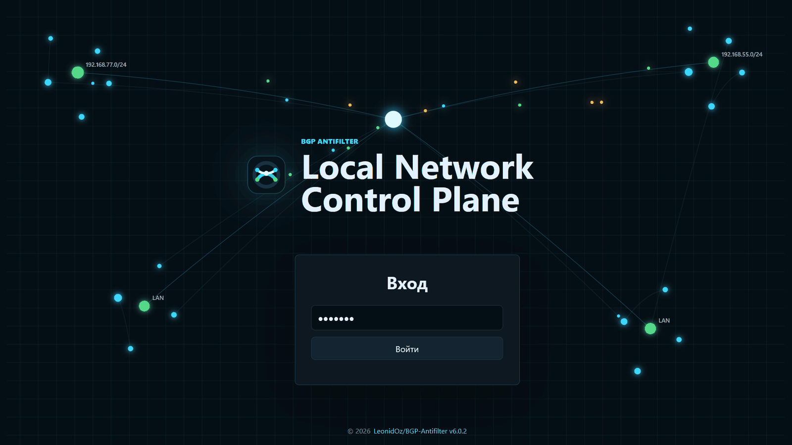

# BGP Antifilter


[English](README.en.md) | Русский

BGP Antifilter собирает списки IPv4-адресов и передаёт маршруты по BGP на ваш маршрутизатор.
Роутер использует эти маршруты, чтобы отправлять выбранный трафик через ваш VPN.
Списками и обновлениями можно управлять в веб-панели.

**VPN должен быть настроен заранее.** Приложение обновляет маршруты; подключение к VPN настраивается отдельно.



Скриншоты без анимации: [вход](docs/assets/admin-login.png) · [панель](docs/assets/admin-dashboard.png) · [списки](docs/assets/admin-lists.png) · [страны](docs/assets/admin-countries.png).

## Что понадобится

- Linux-сервер или мини-ПК с Docker Engine и плагином Docker Compose.
- Маршрутизатор или сервер с IPv4 BGP, фильтрацией по community и возможностью направить принятые маршруты в VPN.
- Работающий VPN и доступ между BGP peer и Linux-сервером.

Примеры подключения: [FRRouting](docs/frr.md) и [MikroTik RouterOS](docs/mikrotik.md). [Общие требования BGP](docs/bgp.md).

Поддерживаются процессоры amd64 и arm64. Команды ниже выполняются в терминале Linux-сервера.
Если используете Portainer, откройте [установку через Portainer](docs/portainer.md).

## Установка

### 1. Скачайте файл запуска

```bash
mkdir -p bgp-antifilter
cd bgp-antifilter
curl -fsSL https://raw.githubusercontent.com/LeonidOz/BGP-Antifilter/main/deploy/portainer-stack.yml -o compose.yaml
```

### 2. Укажите адреса и пароль

Создайте файл `.env` в этой же папке:

```bash
nano .env
```

Вставьте настройки и замените адреса и пароль на свои:

```dotenv
BGP_ANTIFILTER_VERSION=1.0.1
BGP_ANTIFILTER_IMAGE=ghcr.io/leonidoz/bgp-antifilter:${BGP_ANTIFILTER_VERSION}
PEER_IP=192.168.55.1
BIRD_IP=192.168.55.5
ROUTER_ID=192.168.55.5
MY_AS=64500
PEER_AS=65455
BGP_COMMUNITY=65432,500
ADMIN_PASSWORD='replace-with-your-password'
```

| Параметр | Что указать |
| --- | --- |
| `PEER_IP` | IP-адрес BGP peer, доступный с сервера |
| `BIRD_IP` | Существующий IP-адрес Linux-сервера, доступный с BGP peer |
| `ROUTER_ID` | Для простой сети — тот же адрес, что и `BIRD_IP` |
| `MY_AS`, `PEER_AS` | Номера сторон BGP; в новой установке можно оставить пример |
| `BGP_COMMUNITY` | Метка маршрутов; оставьте пример и используйте её во входящем фильтре BGP peer |
| `ADMIN_PASSWORD` | Ваш пароль для входа в панель |

`BIRD_IP` не создаёт новый IP-адрес. Проверьте адреса сервера командой `ip -4 addr`.
Номер версии задаётся первой строкой; следующую строку с именем образа менять не нужно.
Старые `MT_IP` и `MT_AS` продолжают работать; [правила совместимости](docs/bgp.md#совместимость-настроек).

### 3. Запустите приложение

```bash
docker compose up -d
docker compose logs -f --tail=50
```

Docker скачает готовый образ. При первом запуске приложение само создаст стандартные списки
и загрузит маршруты. Дождитесь завершения первой загрузки; выход из просмотра логов — `Ctrl+C`,
контейнер продолжит работать.

Откройте **http://192.168.55.5:8080**, подставив адрес своего сервера, и введите пароль из `.env`.
Панель работает на порту `8080`; для другого порта добавьте в `.env` строку `ADMIN_PORT=8081`
и снова выполните `docker compose up -d`.
Оставьте доступ к панели в своей LAN или VPN.

Данные хранятся в Docker volumes и сохраняются при пересоздании контейнера.
Для перехода существующей установки на отдельный том конфигурации сначала прочитайте
[порядок миграции](docs/usage.md#переход-к-раздельному-хранению).

### 4. Подключите BGP peer

Начните с [общей схемы BGP](docs/bgp.md), затем выберите пример для
[FRRouting](docs/frr.md) или [MikroTik](docs/mikrotik.md).
На принимающей стороне настройте фильтр community и VPN-шлюз: само приложение трафик в VPN не пересылает.

### 5. Проверьте результат

В веб-панели должны появиться маршруты и установленное BGP-соединение.
На сервере выполните:

```bash
docker compose ps
docker compose exec bgp-antifilter birdc show protocols
```

После первой загрузки и настройки BGP peer ожидаются статус `healthy` и состояние
`Established` у BGP-сессии. До подключения роутера статус `unhealthy` возможен:
проверка ожидает BGP-соединение.

Проверьте с устройства за маршрутизатором доступ к ресурсу из списка и его маршрут через VPN.

## Дальше

- [Изменить списки, настроить обновления или найти ошибку](docs/usage.md).
- [Обновить приложение и сохранить данные](docs/usage.md#обновление-приложения).
- [Экспортировать MikroTik Address List вместо BGP](docs/mikrotik.md#address-list-вместо-bgp).
- [Собрать из исходников, посмотреть структуру кода и запустить проверки](docs/development.md).
- [История изменений](CHANGELOG.md).
